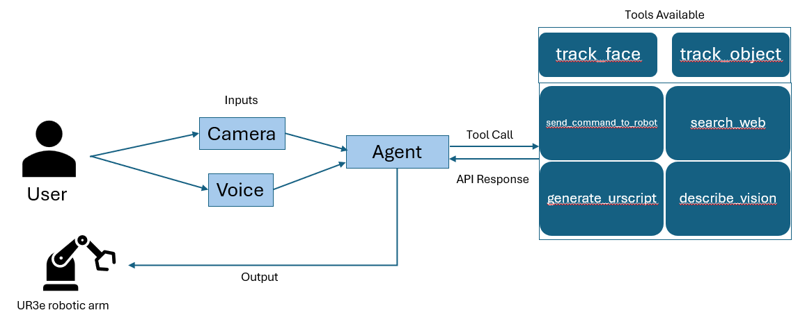
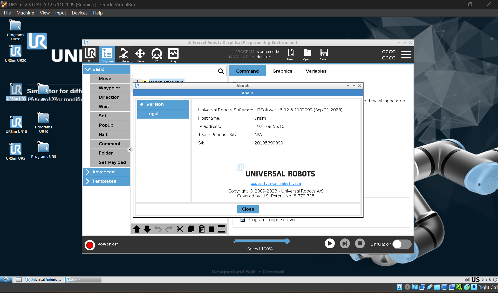
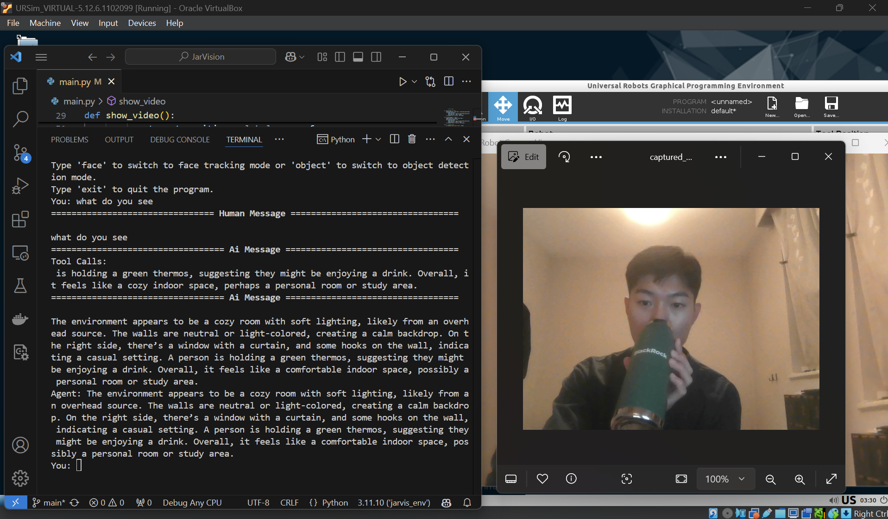
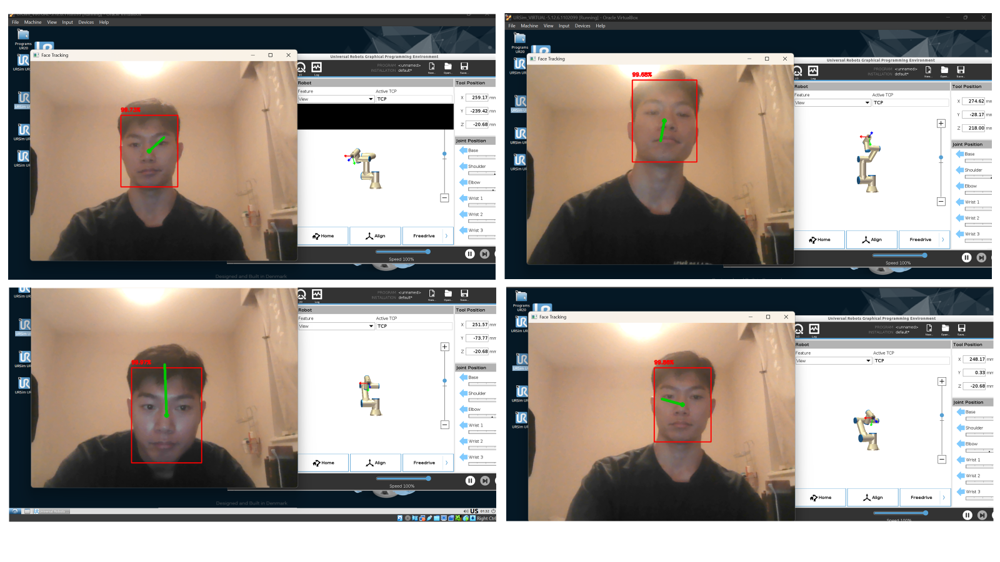
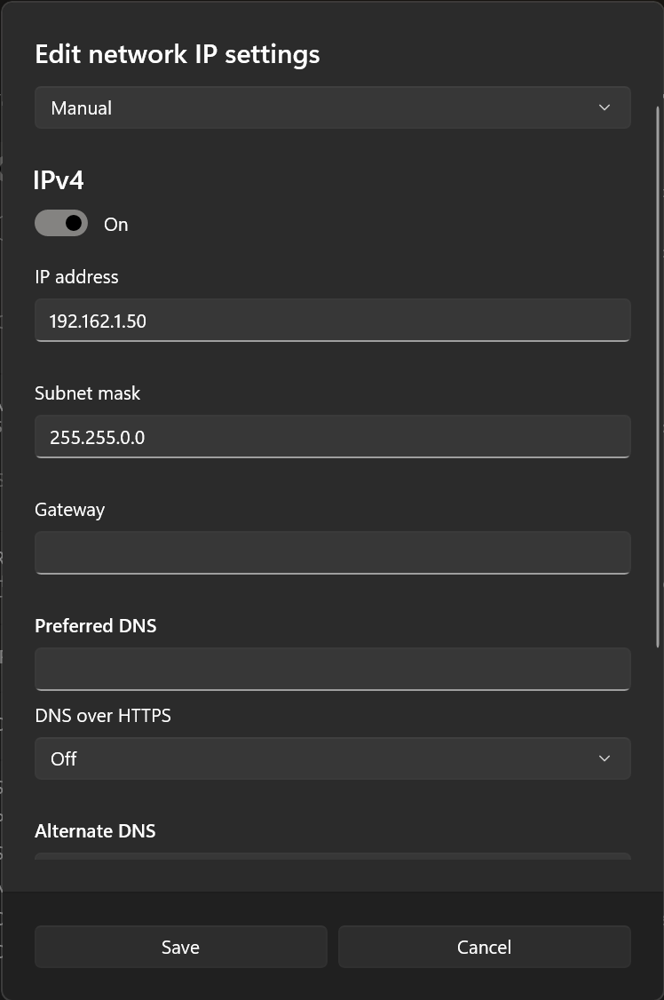

# JarVision: Intelligent Interface for Robotic Arm Control


**JarVision** is an intelligent interface developed for the **UR3e robotic arm**, integrating advanced computer vision and natural language processing (NLP) technologies. This project enables seamless human-robot interaction through natural language commands and real-time visual perception of the robot's environment.

## Table of Contents

- [Project Overview](#project-overview)
- [Features](#features)
- [System Architecture](#system-architecture)
- [Technologies Used](#technologies-used)
- [Setup Instructions](#setup-instructions)
- [Usage](#usage)
- [Future Work](#future-work)
- [Acknowledgments](#acknowledgments)

## Project Overview

JarVision bridges the gap between humans and robots by combining natural language processing with computer vision to empower the UR3e robotic arm to interpret complex user commands, interact dynamically with its environment, and execute tasks with precision.

## Features

- **Face and Object Detection:** Utilizes OpenCV and YOLO algorithms for real-time face/object tracking and interaction.
- **Environment Description:** Generates detailed, context-aware descriptions of surroundings using OpenAI’s Vision API.
- **Natural Language Command Processing:** Leverages LangChain and OpenAI’s ChatGPT API to process nuanced user queries.
- **Modular Design:** Tools like `track_face` and `track_object` are integrated via LangChain for scalable and maintainable functionality.

## System Architecture

The system architecture includes the following components:
1. **Video and Audio Input:** Captures video feed from a camera mounted on the UR3e robotic arm and voice commands from microphone.
2. **LangChain Agent:** Processes user commands and determines the appropriate action.
3. **Tools:** Includes functionalities like face tracking, object tracking, environment description, and robot control.
4. **Robot Control Output:** Sends URScript commands to the robotic arm for task execution.



## Technologies Used

- **Programming Languages:** Python
- **Computer Vision:** OpenCV, YOLO
- **Natural Language Processing:** OpenAI’s ChatGPT API, LangChain
- **Simulations:** Universal Robots Offline Simulator (URSim)
- **Hardware:** UR3e robotic arm
- **Others:** Tavily API

## Setup Instructions

1. Clone the repository:
   ```bash
   git clone https://github.com/EdmundNegan/JarVision.git
2. Navigate to the project directory:
    ```bash 
    cd JarVision
3. Set up the Python environment:
    ```bash
    python -m venv jarvision_env
    source jarvision_env/bin/activate  # For Linux/Mac
    jarvision_env\\Scripts\\activate     # For Windows
4. Install the required dependencies:
    ```bash
    pip install -r requirements.txt

For Virtual Environment 
5. Download the latest version of Oracle VirtualBox from https://www.virtualbox.org/ (or your preferred virtualization software).  

6. Download the offline simulator for the UR3e robotic arm from Universal Robots https://www.universal-robots.com/download/software-e-series/simulator-non-linux/offline-simulator-e-series-ur-sim-for-non-linux-5126-lts/.  

7. Set the virtual machine network type to "host only Ethernet adapter".  

8. Find the IP address of the robot in URSim by clicking URSim UR3 and selecting the "About" option.
  

9. Create a .env file in the project root directory with the following format:
    ```plaintext
    OPENAI_API_KEY=<insert api key>
    TAVILY_API_KEY=<insert api key>
    HOST='<insert robot ip>'
    PORT='30002'
    VOSK_MODEL='PATH_TO_VOSK_MODEL'  

10. Set the payload to an arbitrary number like 0.1kg and start the robot.
  

11. Run the main.py file to begin issuing commands to the robotic arm (select chatbot or voice mode and use default camera settings)



For Physical Robot
5. Connect UR3e robotic arm to power supply and start up system
  

6. Connect UR3e robotic arm to host computer via ethernet cable and connect Azure Kinect camera to host computer via USB-C cable  

7. Find the IP address of the robot in URSim by selecting the "About" option.
  

8. Create a .env file in the project root directory with the following format:
    ```plaintext
    OPENAI_API_KEY=<insert api key>
    TAVILY_API_KEY=<insert api key>
    HOST='<insert physical robot ip>'
    PORT='30002'
    VOSK_MODEL='PATH_TO_VOSK_MODEL'  

9. Go to network settings and manually configure IP assignment to settings shown
  

10. Run the main.py file to begin issuing commands to the physical robotic arm (select chatbot or voice mode and use Kinect camera settings)  

  

## Future Work
- Upload short videos to the Vision API for enhanced environmental understanding.
- Integrate tracking functionalities (track_face, track_object) as modular LangChain tools.
- Refine spatial awareness for precise distance measurements. (Uncomment depth configuration code in main.py and detection.py to edit)
- Add gripper and mobility to robot

## Acknowledgments

This project was developed as part of an academic project under the guidance of Dr. Yu Wu. It leverages the capabilities of cutting-edge technologies like OpenAI’s APIs and LangChain.

Special thanks to the Universal Robots community for providing simulation tools and the OpenCV community for their vision resources.
